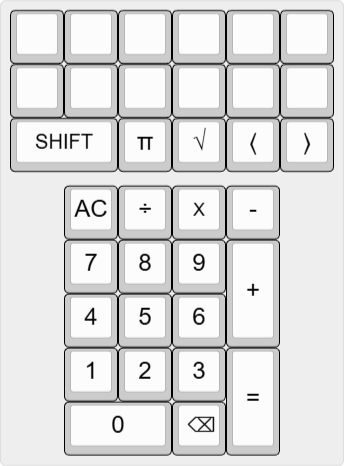
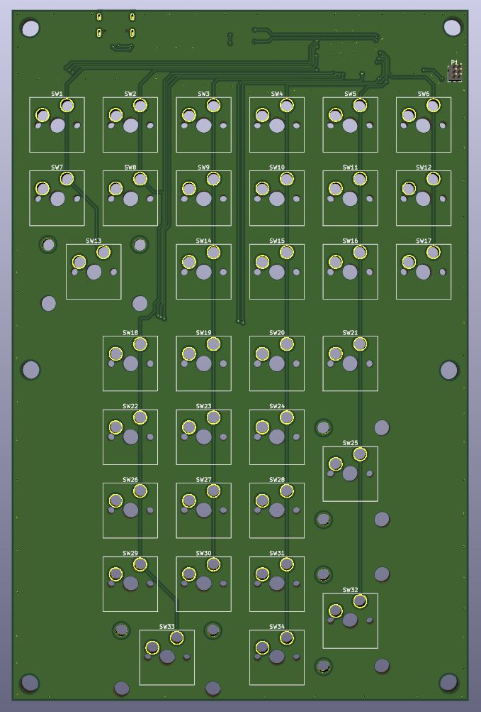
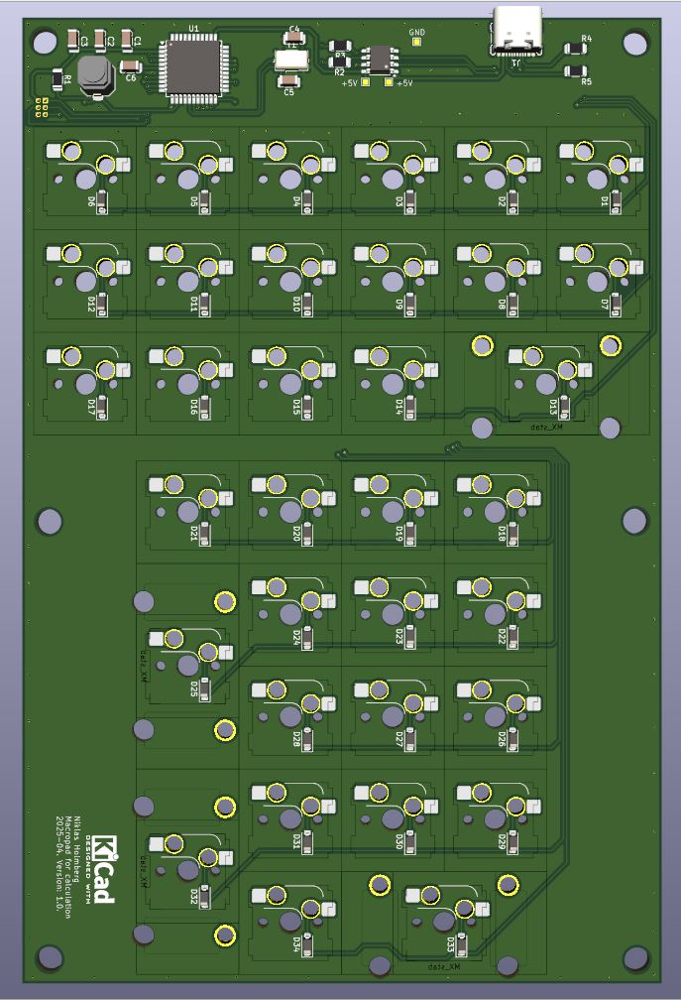

# Electronics-Project
Hi, here I have posted an electronic project that I am working on, in my spare time.
The first is pictures of an ongoing project, where I am working on creating a mechanical keyboard
that will work like a calculator and you will be able to select math functions on the upper keys.
Here is a picture of the layout.

Below are pictures of the circuit board I am creating. The side that should be facing up is the first picture.
The second picture is the back of the circuit board.

Complete keyboard with circuit board, components, keys and caps.

---

