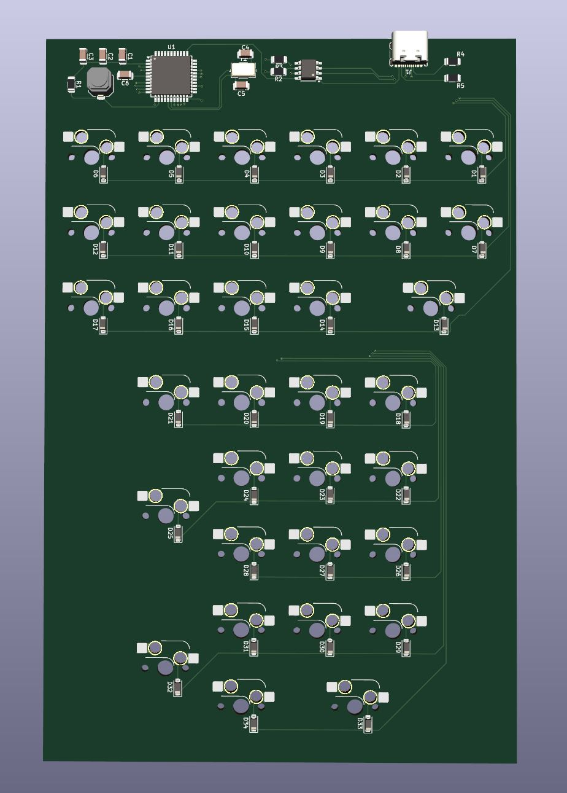
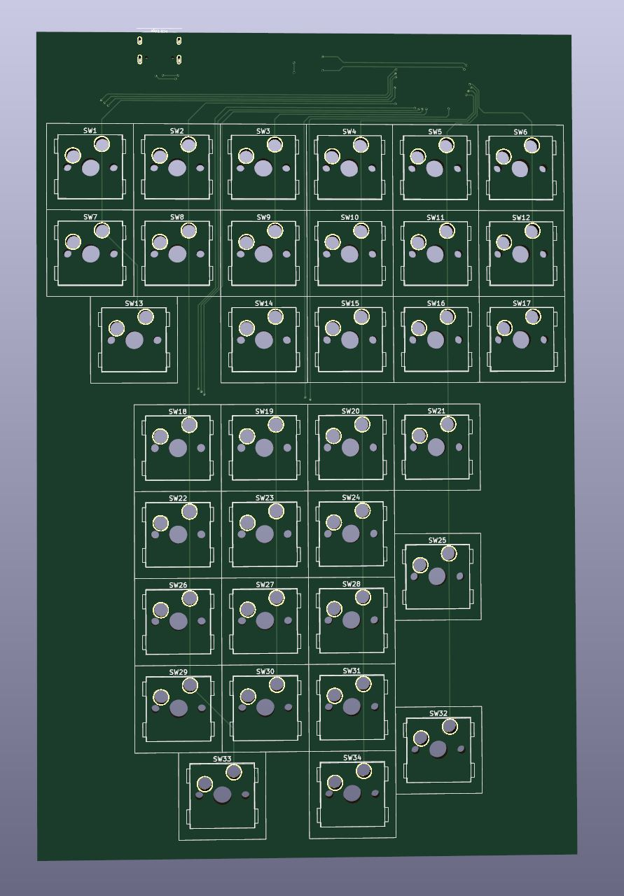

# Electronics-Project
Hej här har jag lagt upp några elektronic projekt som jag håller på med, på min fritid.
Det första är bilder på ett pågående projekt, där jag håller på och skapar ett mekaniskt tangentbord
som ska funka som en miniräknare och man ska kunna välja mattefunktioner på dom övre tangenterna.
Här är en bild på layout.

Här nedanför är bilder på kretskortet jag håller på att skapa, detta är från en bit in i skapar processen.

Har efter dessa bilder lagt till hål för dom större tangenternas stabilatorer.
